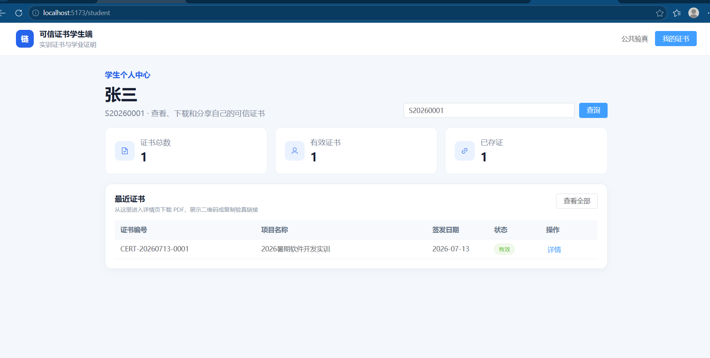
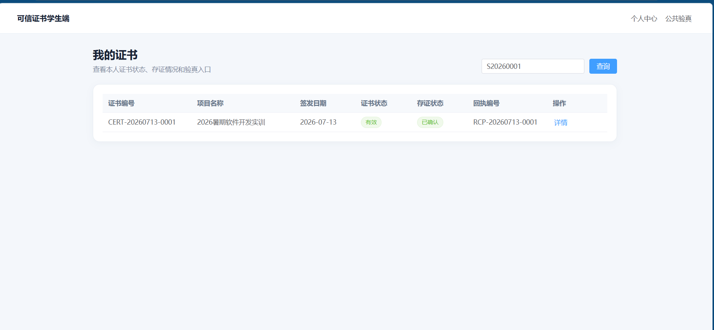
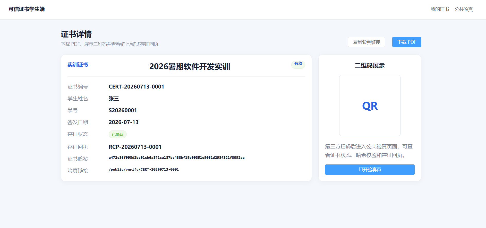
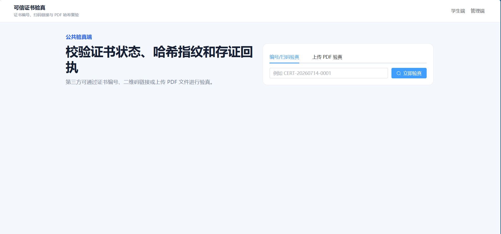
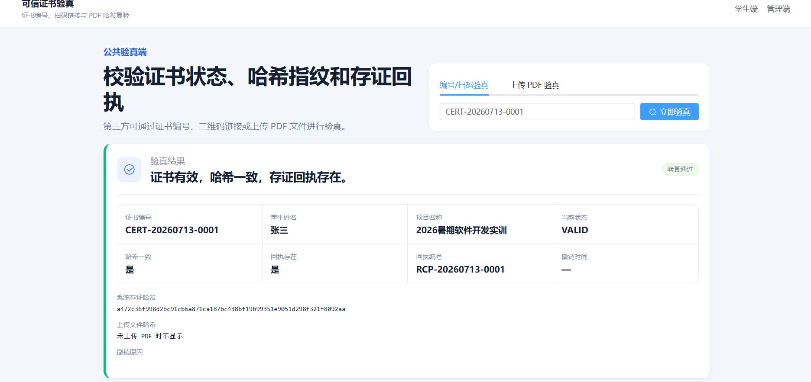

# 学生端与公共验真端页面展示

## 1. 学生个人中心

学生可通过学号进入个人中心，查看证书总数、有效证书数量和已存证证书数量。

## 2. 我的证书

“我的证书”页面展示证书编号、项目名称、签发日期、证书状态、存证状态和回执编号。

## 3. 证书详情

证书详情页支持查看证书哈希、存证回执、验真链接，并支持 PDF 下载和二维码展示。

## 4. 公共验真页面

第三方可通过证书编号或二维码链接进入公共验真页面，查看证书状态、哈希校验结果和存证回执。

## 5. 撤销证书验真

当管理员撤销证书后，第三方再次验真可看到证书已撤销及相关状态变化。

## 6. 上传 PDF 验真

公共验真端支持上传 PDF 文件进行哈希复验，用于判断文件是否被篡改。

## 说明

本次页面展示覆盖本人负责的学生端、公共验真端与验真测试相关内容，包括：

- 学生个人中心
- 我的证书
- 证书详情
- PDF 下载
- 二维码展示
- 证书编号验真
- 扫码验真
- 上传 PDF 验真
- 验真结果展示
- 撤销证书状态展示