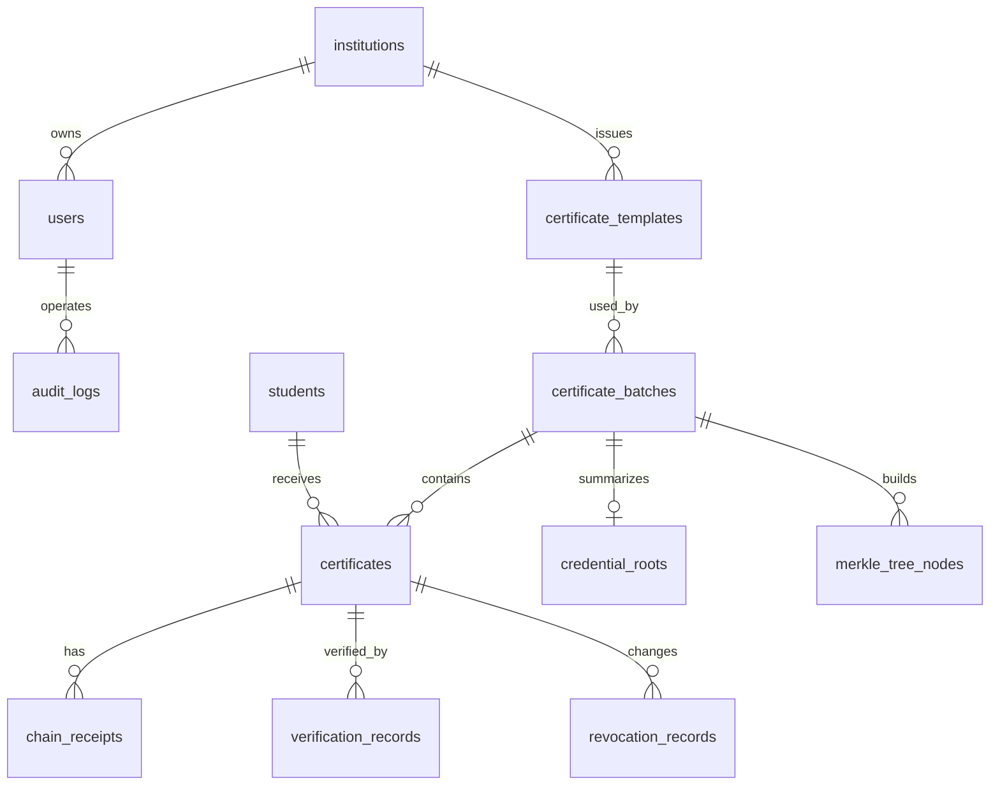

# 数据库设计

本文档用于统一可信证书存证系统的核心数据表、字段和关系。当前设计优先支持两周内的证书闭环，后续可扩展到 Merkle Root、DID/VC 和可信简历。

## 1. 设计原则

1. 证书是当前系统的第一类对象，所有流程围绕 `certificates` 表展开。
2. 证书编号、PDF、二维码、哈希、回执和状态必须能互相追踪。
3. 哈希和回执用于证明“存证后文件未被篡改”，状态字段用于判断“当前是否有效”。
4. 当前使用模拟学生数据，不存储真实隐私。
5. FISCO BCOS 接入不改变核心业务表，只扩展回执字段。

## 2. ER 图草案



## 3. 核心表清单

| 表名 | 用途 | 优先级 |
| --- | --- | --- |
| `users` | 登录账号、角色权限 | P0 |
| `institutions` | 颁发机构 | P0 |
| `students` | 学生模拟数据 | P0 |
| `certificate_templates` | 证书模板 | P0 |
| `certificate_batches` | 发证批次 | P0 |
| `certificates` | 单张证书主表 | P0 |
| `chain_receipts` | 本地哈希链或测试链回执 | P0 |
| `verification_records` | 验真记录 | P1 |
| `revocation_records` | 撤销/补发记录 | P1 |
| `audit_logs` | 操作日志 | P1 |
| `credential_roots` | 每批次的 Merkle Root，及与上一批次 Root 的链式关联 | P2 |
| `merkle_tree_nodes` | Merkle 树各层节点，用于生成单证书 Merkle Proof | P2 |

## 4. 建表 SQL 草案

> 说明：字段类型以 MySQL 为基准，后端采用 FastAPI 时建议通过 SQLAlchemy / SQLModel / 原生 SQL 之一保持字段名一致。

```sql
CREATE TABLE institutions (
  institution_id BIGINT PRIMARY KEY AUTO_INCREMENT,
  institution_name VARCHAR(100) NOT NULL,
  institution_code VARCHAR(50) NOT NULL UNIQUE,
  created_at DATETIME NOT NULL DEFAULT CURRENT_TIMESTAMP
);

CREATE TABLE users (
  user_id BIGINT PRIMARY KEY AUTO_INCREMENT,
  username VARCHAR(50) NOT NULL UNIQUE,
  password_hash VARCHAR(255) NOT NULL,
  display_name VARCHAR(100) NOT NULL,
  role VARCHAR(30) NOT NULL,
  institution_id BIGINT,
  created_at DATETIME NOT NULL DEFAULT CURRENT_TIMESTAMP,
  FOREIGN KEY (institution_id) REFERENCES institutions(institution_id)
);

CREATE TABLE students (
  student_id BIGINT PRIMARY KEY AUTO_INCREMENT,
  student_no VARCHAR(50) NOT NULL UNIQUE,
  student_name VARCHAR(100) NOT NULL,
  college VARCHAR(100),
  major VARCHAR(100),
  class_name VARCHAR(100),
  created_at DATETIME NOT NULL DEFAULT CURRENT_TIMESTAMP
);

CREATE TABLE certificate_templates (
  template_id BIGINT PRIMARY KEY AUTO_INCREMENT,
  template_name VARCHAR(100) NOT NULL,
  institution_id BIGINT NOT NULL,
  template_config JSON,
  status VARCHAR(30) NOT NULL DEFAULT 'ACTIVE',
  created_at DATETIME NOT NULL DEFAULT CURRENT_TIMESTAMP,
  updated_at DATETIME NOT NULL DEFAULT CURRENT_TIMESTAMP ON UPDATE CURRENT_TIMESTAMP,
  FOREIGN KEY (institution_id) REFERENCES institutions(institution_id)
);

CREATE TABLE certificate_batches (
  batch_id BIGINT PRIMARY KEY AUTO_INCREMENT,
  batch_name VARCHAR(100) NOT NULL,
  template_id BIGINT NOT NULL,
  institution_id BIGINT NOT NULL,
  batch_status VARCHAR(30) NOT NULL DEFAULT 'DRAFT',
  total_count INT NOT NULL DEFAULT 0,
  generated_count INT NOT NULL DEFAULT 0,
  evidenced_count INT NOT NULL DEFAULT 0,
  created_by BIGINT,
  created_at DATETIME NOT NULL DEFAULT CURRENT_TIMESTAMP,
  FOREIGN KEY (template_id) REFERENCES certificate_templates(template_id),
  FOREIGN KEY (institution_id) REFERENCES institutions(institution_id),
  FOREIGN KEY (created_by) REFERENCES users(user_id)
);

CREATE TABLE certificates (
  certificate_id BIGINT PRIMARY KEY AUTO_INCREMENT,
  certificate_no VARCHAR(80) NOT NULL UNIQUE,
  student_id BIGINT NOT NULL,
  batch_id BIGINT NOT NULL,
  template_id BIGINT NOT NULL,
  credential_type VARCHAR(30) NOT NULL DEFAULT 'CERTIFICATE',
  project_name VARCHAR(200) NOT NULL,
  issue_time DATETIME,
  pdf_path VARCHAR(500),
  qr_code_path VARCHAR(500),
  verify_url VARCHAR(500),
  certificate_hash CHAR(64),
  receipt_id VARCHAR(100),
  root_id VARCHAR(100),
  status VARCHAR(30) NOT NULL DEFAULT 'DRAFT',
  previous_certificate_no VARCHAR(80),
  created_at DATETIME NOT NULL DEFAULT CURRENT_TIMESTAMP,
  updated_at DATETIME NOT NULL DEFAULT CURRENT_TIMESTAMP ON UPDATE CURRENT_TIMESTAMP,
  FOREIGN KEY (student_id) REFERENCES students(student_id),
  FOREIGN KEY (batch_id) REFERENCES certificate_batches(batch_id),
  FOREIGN KEY (template_id) REFERENCES certificate_templates(template_id)
);

CREATE TABLE chain_receipts (
  receipt_id VARCHAR(100) PRIMARY KEY,
  certificate_no VARCHAR(80) NOT NULL,
  certificate_hash CHAR(64) NOT NULL,
  evidence_type VARCHAR(50) NOT NULL DEFAULT 'LOCAL_HASH_CHAIN',
  previous_hash CHAR(64),
  current_block_hash CHAR(64),
  block_height BIGINT,
  tx_hash VARCHAR(200),
  contract_address VARCHAR(200),
  evidence_time DATETIME NOT NULL DEFAULT CURRENT_TIMESTAMP,
  status VARCHAR(30) NOT NULL DEFAULT 'CONFIRMED',
  FOREIGN KEY (certificate_no) REFERENCES certificates(certificate_no)
);

CREATE TABLE verification_records (
  verification_id BIGINT PRIMARY KEY AUTO_INCREMENT,
  certificate_no VARCHAR(80),
  verify_type VARCHAR(30) NOT NULL,
  uploaded_hash CHAR(64),
  stored_hash CHAR(64),
  hash_match BOOLEAN,
  verify_result VARCHAR(30) NOT NULL,
  verify_message VARCHAR(255),
  verified_at DATETIME NOT NULL DEFAULT CURRENT_TIMESTAMP,
  FOREIGN KEY (certificate_no) REFERENCES certificates(certificate_no)
);

CREATE TABLE revocation_records (
  revocation_id BIGINT PRIMARY KEY AUTO_INCREMENT,
  certificate_no VARCHAR(80) NOT NULL,
  action_type VARCHAR(30) NOT NULL,
  reason VARCHAR(255) NOT NULL,
  operated_by BIGINT,
  operated_at DATETIME NOT NULL DEFAULT CURRENT_TIMESTAMP,
  new_certificate_no VARCHAR(80),
  FOREIGN KEY (certificate_no) REFERENCES certificates(certificate_no),
  FOREIGN KEY (operated_by) REFERENCES users(user_id)
);

CREATE TABLE audit_logs (
  audit_id BIGINT PRIMARY KEY AUTO_INCREMENT,
  user_id BIGINT,
  action VARCHAR(100) NOT NULL,
  target_type VARCHAR(50),
  target_id VARCHAR(100),
  detail TEXT,
  ip_address VARCHAR(50),
  created_at DATETIME NOT NULL DEFAULT CURRENT_TIMESTAMP,
  FOREIGN KEY (user_id) REFERENCES users(user_id)
);

-- 以下两张表为 P2 加分项，服务于 Merkle Root 批量存证方案，详见第 9 节
CREATE TABLE credential_roots (
  root_id VARCHAR(100) PRIMARY KEY,
  batch_id BIGINT NOT NULL,
  merkle_root CHAR(64) NOT NULL,
  leaf_count INT NOT NULL,
  leaf_order_rule VARCHAR(100) NOT NULL DEFAULT 'CERTIFICATE_NO_ASC',
  odd_leaf_rule VARCHAR(100) NOT NULL DEFAULT 'DUPLICATE_LAST',
  previous_root_hash CHAR(64),
  current_root_hash CHAR(64) NOT NULL,
  evidence_type VARCHAR(50) NOT NULL DEFAULT 'LOCAL_ROOT_CHAIN',
  tx_hash VARCHAR(200),
  block_height BIGINT,
  created_at DATETIME NOT NULL DEFAULT CURRENT_TIMESTAMP,
  UNIQUE KEY uk_credential_roots_batch (batch_id),
  FOREIGN KEY (batch_id) REFERENCES certificate_batches(batch_id)
);

CREATE TABLE merkle_tree_nodes (
  node_id BIGINT PRIMARY KEY AUTO_INCREMENT,
  root_id VARCHAR(100) NOT NULL,
  batch_id BIGINT NOT NULL,
  certificate_no VARCHAR(80),
  level INT NOT NULL,
  position_in_level INT NOT NULL,
  node_hash CHAR(64) NOT NULL,
  parent_position INT,
  created_at DATETIME NOT NULL DEFAULT CURRENT_TIMESTAMP,
  UNIQUE KEY uk_merkle_node_position (root_id, level, position_in_level),
  FOREIGN KEY (root_id) REFERENCES credential_roots(root_id),
  FOREIGN KEY (batch_id) REFERENCES certificate_batches(batch_id)
);
```

## 5. 状态枚举

### 5.1 证书状态 `certificates.status`

| 状态 | 含义 |
| --- | --- |
| `DRAFT` | 已创建但未生成 PDF |
| `GENERATED` | 已生成 PDF 和二维码 |
| `EVIDENCED` | 已完成存证 |
| `VALID` | 当前有效，可验真通过 |
| `REVOKED` | 已撤销 |
| `REISSUED` | 已补发，旧证书保留关联 |
| `EXPIRED` | 已过期 |

### 5.2 批次状态 `certificate_batches.batch_status`

| 状态 | 含义 |
| --- | --- |
| `DRAFT` | 草稿 |
| `IMPORTED` | 已导入学生 |
| `GENERATED` | 已生成证书 |
| `EVIDENCED` | 已存证 |
| `COMPLETED` | 已完成 |
| `CANCELLED` | 已取消 |

## 6. 必须保持的一致性

1. `certificates.certificate_no` 是二维码、验真和展示的主线索。
2. `certificates.certificate_hash` 必须来自最终 PDF 文件的 SHA-256。
3. `certificates.receipt_id` 必须能关联到 `chain_receipts.receipt_id`。
4. 撤销后必须更新 `certificates.status`，并写入 `revocation_records` 和 `audit_logs`。
5. 上传 PDF 复验时，只比较上传文件哈希和系统保存哈希，不覆盖原始哈希。
6. 补发必须生成新的 `certificate_no`、PDF、哈希和回执，并保留旧证书关联。
7. `certificates.root_id` 如果填写，必须能关联到 `credential_roots.root_id`；该字段服务于第 9 节的 Merkle Root 方案，不影响 P0 主线的单证书哈希验真。

## 7. 初始演示数据建议

| 类型 | 示例 |
| --- | --- |
| 机构 | 示范学院 |
| 管理员 | 服务器交互式初始化；不记录、展示或提交密码 |
| 学生 | 5-10 名模拟学生 |
| 模板 | 2026 暑期实训结业证书 |
| 批次 | 2026 暑期实训第一批 |

## 7.1 2026-07-23 线上协作认证表

当前线上版本已实际使用以下账号相关表，不再依赖固定演示账号：

| 表 | 关键字段 | 约束与用途 |
| --- | --- | --- |
| `users` | `user_id`、`username`、`display_name`、`password_hash`、`role`、`is_active` | 用户名唯一；密码仅保存 Argon2 哈希；禁用账号后不可继续登录 |
| `invitations` | `invitation_id`、`token_hash`、`role`、`created_by`、`expires_at`、`used_at` | 只保存邀请 token 的 SHA-256，原 token 只在创建响应中出现一次；当前只创建 `TEACHER` 邀请 |
| `auth_sessions` | `jti`、`user_id`、`expires_at`、`revoked_at` | JWT 通过 `jti` 关联可撤销会话；登出或禁用账号会写入 `revoked_at` |

角色范围：`ADMIN` 管理账号与教师邀请；`TEACHER` 处理证书业务；`AUDITOR` 仅只读存证与审计数据。学生端尚未有用户表绑定的正式登录，不应把 `student_no` 演示参数写为认证字段。

## 8. 撤销与补发数据一致性

### 8.1 撤销旧证书

撤销操作必须同时完成：

1. `certificates.status` 更新为 `REVOKED`。
2. `revocation_records` 新增一条 `action_type = 'REVOKE'` 的记录。
3. `audit_logs` 新增管理员操作日志。
4. 公共验真接口返回撤销状态、撤销原因和撤销时间。

### 8.2 补发新证书

补发操作必须生成一张新的证书记录：

| 字段 | 规则 |
| --- | --- |
| `certificate_no` | 重新生成，不复用旧编号 |
| `pdf_path` | 重新生成新 PDF |
| `qr_code_path` | 重新生成新二维码 |
| `verify_url` | 指向新证书编号或新 token |
| `certificate_hash` | 对新 PDF 重新计算 SHA-256 |
| `receipt_id` | 重新存证，生成新回执 |
| `previous_certificate_no` | 指向旧证书编号 |

旧证书必须保留，不允许物理删除。旧证书验真结果应显示“已撤销”或“已补发”，新证书验真结果按当前状态判断。

### 8.3 验真判断顺序

公共验真建议按以下顺序判断：

1. 证书编号是否存在。
2. 证书是否已生成 PDF 和哈希。
3. 是否存在存证回执。
4. 如上传 PDF，则比较上传文件哈希和系统保存哈希。
5. 检查证书当前状态是否为 `VALID` 或可视为有效的状态。
6. 根据以上结果返回明确失败原因。

## 9. Merkle Root 与 Root 链设计（P2 加分项）

本节是在第 8 节“单证书本地哈希链”基础上的可选增强，用于降低批量上链成本，并支持“只出示单张证书即可证明其属于某一批存证”的验证方式。P0 主线闭环不依赖本节，未完成不影响验收。

### 9.1 叶子与 Root 的计算范围

- 叶子节点：同一批次（`batch_id`）内每张证书的 `certificate_hash`，与 `chain_receipts` 里已有的哈希是同一个值，不重复计算。
- 叶子排序：固定按 `certificate_no` 升序排列后依次作为第 0 层叶子，`position_in_level` 从 0 开始递增；不得使用数据库默认返回顺序或 PDF 生成顺序。
- 奇数叶处理：某一层节点数为奇数时，复制该层最后一个节点作为右节点参与父节点计算，规则记录到 `credential_roots.odd_leaf_rule = 'DUPLICATE_LAST'`。
- 父节点计算：`parent_hash = SHA256(left_node_hash + right_node_hash)`，其中左右节点哈希均为 64 位小写十六进制字符串，直接拼接后计算。
- Root 只在该批次“存证”动作完成、批次内所有证书都已生成哈希之后统一计算一次，不随单张证书生成而触发。
- Root 的计算范围只限于当前批次自身的叶子，不需要拿其他批次的证书数据参与计算。

### 9.2 Root 之间的链式结构（Root 链）

`credential_roots` 每条记录额外保存 `previous_root_hash` 和 `current_root_hash`，构造方式与 `chain_receipts` 的本地哈希链口径一致：

```text
current_root_hash = SHA256(batch_id + merkle_root + previous_root_hash + created_at)
```

`previous_root_hash` 取上一条 `credential_roots` 记录的 `current_root_hash`，只需读取一个已存在的哈希字符串，不需要重新拉取或重算历史批次的证书数据，写入成本不随批次数量增长。

### 9.3 Merkle Proof 与验证

- `merkle_tree_nodes` 保存每个批次树的所有节点，叶子节点额外填写 `certificate_no`，内部节点 `certificate_no` 为空；通过 `root_id + level + position_in_level` 唯一定位节点。
- 生成某张证书的 Merkle Proof 时，先用 `certificate_no` 找到第 0 层叶子位置，再逐层取兄弟节点哈希，并同时返回兄弟节点在当前节点左侧还是右侧。
- Proof 每一项必须包含 `sibling_hash` 和 `direction`，其中 `direction = 'LEFT'` 表示兄弟节点在当前累计哈希左侧，重算时使用 `SHA256(sibling_hash + current_hash)`；`direction = 'RIGHT'` 表示兄弟节点在右侧，重算时使用 `SHA256(current_hash + sibling_hash)`。
- 验证某张证书时，验证方只需要该证书自身哈希 + 一份 Merkle Proof（长度约为 log2(N)，N 为该批次证书数），不需要拿到批次内其他证书的数据；逐层重算得到的哈希需与 `credential_roots.merkle_root` 一致才算通过。

### 9.4 撤销与 Root 的解耦（重要约束）

- Root 一旦生成，代表“该批次证书内容在存证时刻未被篡改”，是历史事实，不会因为任何证书被撤销而重新计算或替换。
- 撤销操作仅按第 8.1 节更新 `certificates.status` 并写入 `revocation_records`，禁止修改 `credential_roots` 或 `merkle_tree_nodes` 的任何已有记录。
- 验真结果需分别展示两类判断：内容完整性（Merkle Proof 是否通过，对应“是否被篡改”）与当前有效性（`certificates.status`，对应“现在是否还有效”），两者互不影响，可能出现“内容验证通过但已撤销”的组合结果。

### 9.5 上链范围（如接入测试链）

如果本节配合测试链使用，只有 `credential_roots.merkle_root` 这一个值需要作为交易写上链（一个批次一笔交易），单张证书的哈希始终只保存在本地 `chain_receipts` 表中，不逐张单独上链，以控制上链次数和成本。
