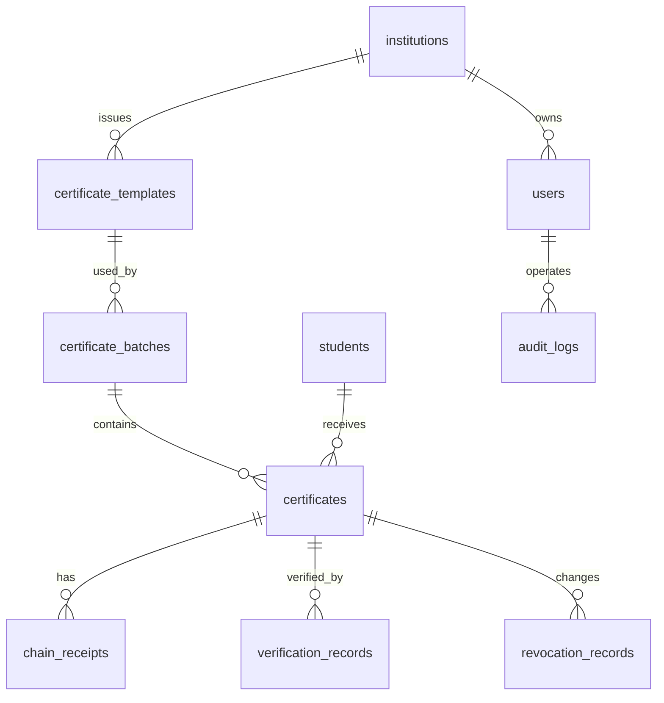

# 数据库设计

本文档用于统一可信证书存证系统的核心数据表、字段和关系。当前设计优先支持两周内的证书闭环，后续可扩展到 Merkle Root、DID/VC 和可信简历。

## 1. 设计原则

1. 证书是当前系统的第一类对象，所有流程围绕 `certificates` 表展开。
2. 证书编号、PDF、二维码、哈希、回执和状态必须能互相追踪。
3. 哈希和回执用于证明“存证后文件未被篡改”，状态字段用于判断“当前是否有效”。
4. 当前使用模拟学生数据，不存储真实隐私。
5. FISCO BCOS 接入不改变核心业务表，只扩展回执字段。

## 2. ER 图草案



## 3. 核心表清单

| 表名 | 用途 | 优先级 |
| --- | --- | --- |
| `users` | 登录账号、角色权限 | P0 |
| `institutions` | 颁发机构 | P0 |
| `students` | 学生模拟数据 | P0 |
| `certificate_templates` | 证书模板 | P0 |
| `certificate_batches` | 发证批次 | P0 |
| `certificates` | 单张证书主表 | P0 |
| `chain_receipts` | 本地哈希链或测试链回执 | P0 |
| `verification_records` | 验真记录 | P1 |
| `revocation_records` | 撤销/补发记录 | P1 |
| `audit_logs` | 操作日志 | P1 |
| `credential_roots` | Merkle Root 或批量承诺根 | P2 |

## 4. 建表 SQL 草案

> 说明：字段类型以 MySQL 为基准，后续可按实际后端框架微调。

```sql
CREATE TABLE institutions (
  institution_id BIGINT PRIMARY KEY AUTO_INCREMENT,
  institution_name VARCHAR(100) NOT NULL,
  institution_code VARCHAR(50) NOT NULL UNIQUE,
  created_at DATETIME NOT NULL DEFAULT CURRENT_TIMESTAMP
);

CREATE TABLE users (
  user_id BIGINT PRIMARY KEY AUTO_INCREMENT,
  username VARCHAR(50) NOT NULL UNIQUE,
  password_hash VARCHAR(255) NOT NULL,
  display_name VARCHAR(100) NOT NULL,
  role VARCHAR(30) NOT NULL,
  institution_id BIGINT,
  created_at DATETIME NOT NULL DEFAULT CURRENT_TIMESTAMP,
  FOREIGN KEY (institution_id) REFERENCES institutions(institution_id)
);

CREATE TABLE students (
  student_id BIGINT PRIMARY KEY AUTO_INCREMENT,
  student_no VARCHAR(50) NOT NULL UNIQUE,
  student_name VARCHAR(100) NOT NULL,
  college VARCHAR(100),
  major VARCHAR(100),
  class_name VARCHAR(100),
  created_at DATETIME NOT NULL DEFAULT CURRENT_TIMESTAMP
);

CREATE TABLE certificate_templates (
  template_id BIGINT PRIMARY KEY AUTO_INCREMENT,
  template_name VARCHAR(100) NOT NULL,
  institution_id BIGINT NOT NULL,
  template_config JSON,
  status VARCHAR(30) NOT NULL DEFAULT 'ACTIVE',
  created_at DATETIME NOT NULL DEFAULT CURRENT_TIMESTAMP,
  updated_at DATETIME NOT NULL DEFAULT CURRENT_TIMESTAMP ON UPDATE CURRENT_TIMESTAMP,
  FOREIGN KEY (institution_id) REFERENCES institutions(institution_id)
);

CREATE TABLE certificate_batches (
  batch_id BIGINT PRIMARY KEY AUTO_INCREMENT,
  batch_name VARCHAR(100) NOT NULL,
  template_id BIGINT NOT NULL,
  institution_id BIGINT NOT NULL,
  batch_status VARCHAR(30) NOT NULL DEFAULT 'DRAFT',
  total_count INT NOT NULL DEFAULT 0,
  generated_count INT NOT NULL DEFAULT 0,
  evidenced_count INT NOT NULL DEFAULT 0,
  created_by BIGINT,
  created_at DATETIME NOT NULL DEFAULT CURRENT_TIMESTAMP,
  FOREIGN KEY (template_id) REFERENCES certificate_templates(template_id),
  FOREIGN KEY (institution_id) REFERENCES institutions(institution_id),
  FOREIGN KEY (created_by) REFERENCES users(user_id)
);

CREATE TABLE certificates (
  certificate_id BIGINT PRIMARY KEY AUTO_INCREMENT,
  certificate_no VARCHAR(80) NOT NULL UNIQUE,
  student_id BIGINT NOT NULL,
  batch_id BIGINT NOT NULL,
  template_id BIGINT NOT NULL,
  credential_type VARCHAR(30) NOT NULL DEFAULT 'CERTIFICATE',
  project_name VARCHAR(200) NOT NULL,
  issue_time DATETIME,
  pdf_path VARCHAR(500),
  qr_code_path VARCHAR(500),
  verify_url VARCHAR(500),
  certificate_hash CHAR(64),
  receipt_id VARCHAR(100),
  root_id VARCHAR(100),
  status VARCHAR(30) NOT NULL DEFAULT 'DRAFT',
  previous_certificate_no VARCHAR(80),
  created_at DATETIME NOT NULL DEFAULT CURRENT_TIMESTAMP,
  updated_at DATETIME NOT NULL DEFAULT CURRENT_TIMESTAMP ON UPDATE CURRENT_TIMESTAMP,
  FOREIGN KEY (student_id) REFERENCES students(student_id),
  FOREIGN KEY (batch_id) REFERENCES certificate_batches(batch_id),
  FOREIGN KEY (template_id) REFERENCES certificate_templates(template_id)
);

CREATE TABLE chain_receipts (
  receipt_id VARCHAR(100) PRIMARY KEY,
  certificate_no VARCHAR(80) NOT NULL,
  certificate_hash CHAR(64) NOT NULL,
  evidence_type VARCHAR(50) NOT NULL DEFAULT 'LOCAL_HASH_CHAIN',
  previous_hash CHAR(64),
  current_block_hash CHAR(64),
  block_height BIGINT,
  tx_hash VARCHAR(200),
  contract_address VARCHAR(200),
  evidence_time DATETIME NOT NULL DEFAULT CURRENT_TIMESTAMP,
  status VARCHAR(30) NOT NULL DEFAULT 'CONFIRMED',
  FOREIGN KEY (certificate_no) REFERENCES certificates(certificate_no)
);

CREATE TABLE verification_records (
  verification_id BIGINT PRIMARY KEY AUTO_INCREMENT,
  certificate_no VARCHAR(80),
  verify_type VARCHAR(30) NOT NULL,
  uploaded_hash CHAR(64),
  stored_hash CHAR(64),
  hash_match BOOLEAN,
  verify_result VARCHAR(30) NOT NULL,
  verify_message VARCHAR(255),
  verified_at DATETIME NOT NULL DEFAULT CURRENT_TIMESTAMP,
  FOREIGN KEY (certificate_no) REFERENCES certificates(certificate_no)
);

CREATE TABLE revocation_records (
  revocation_id BIGINT PRIMARY KEY AUTO_INCREMENT,
  certificate_no VARCHAR(80) NOT NULL,
  action_type VARCHAR(30) NOT NULL,
  reason VARCHAR(255) NOT NULL,
  operated_by BIGINT,
  operated_at DATETIME NOT NULL DEFAULT CURRENT_TIMESTAMP,
  new_certificate_no VARCHAR(80),
  FOREIGN KEY (certificate_no) REFERENCES certificates(certificate_no),
  FOREIGN KEY (operated_by) REFERENCES users(user_id)
);

CREATE TABLE audit_logs (
  audit_id BIGINT PRIMARY KEY AUTO_INCREMENT,
  user_id BIGINT,
  action VARCHAR(100) NOT NULL,
  target_type VARCHAR(50),
  target_id VARCHAR(100),
  detail TEXT,
  ip_address VARCHAR(50),
  created_at DATETIME NOT NULL DEFAULT CURRENT_TIMESTAMP,
  FOREIGN KEY (user_id) REFERENCES users(user_id)
);
```

## 5. 状态枚举

### 5.1 证书状态 `certificates.status`

| 状态 | 含义 |
| --- | --- |
| `DRAFT` | 已创建但未生成 PDF |
| `GENERATED` | 已生成 PDF 和二维码 |
| `EVIDENCED` | 已完成存证 |
| `VALID` | 当前有效，可验真通过 |
| `REVOKED` | 已撤销 |
| `REISSUED` | 已补发，旧证书保留关联 |
| `EXPIRED` | 已过期 |

### 5.2 批次状态 `certificate_batches.batch_status`

| 状态 | 含义 |
| --- | --- |
| `DRAFT` | 草稿 |
| `IMPORTED` | 已导入学生 |
| `GENERATED` | 已生成证书 |
| `EVIDENCED` | 已存证 |
| `COMPLETED` | 已完成 |
| `CANCELLED` | 已取消 |

## 6. 必须保持的一致性

1. `certificates.certificate_no` 是二维码、验真和展示的主线索。
2. `certificates.certificate_hash` 必须来自最终 PDF 文件的 SHA-256。
3. `certificates.receipt_id` 必须能关联到 `chain_receipts.receipt_id`。
4. 撤销后必须更新 `certificates.status`，并写入 `revocation_records` 和 `audit_logs`。
5. 上传 PDF 复验时，只比较上传文件哈希和系统保存哈希，不覆盖原始哈希。
6. 补发必须生成新的 `certificate_no`、PDF、哈希和回执，并保留旧证书关联。

## 7. 初始演示数据建议

| 类型 | 示例 |
| --- | --- |
| 机构 | 示范学院 |
| 管理员 | `admin / 123456`，仅限本地演示 |
| 学生 | 5-10 名模拟学生 |
| 模板 | 2026 暑期实训结业证书 |
| 批次 | 2026 暑期实训第一批 |
