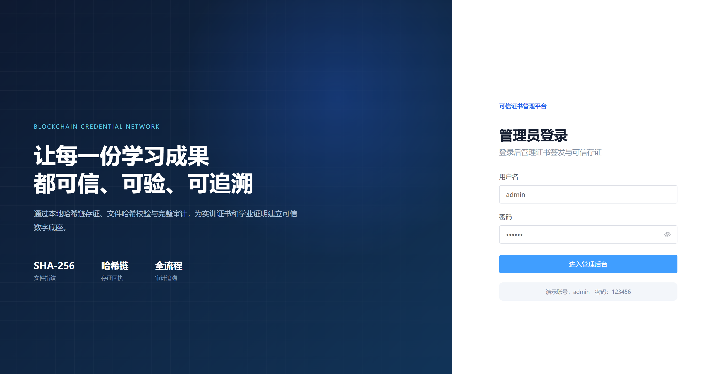
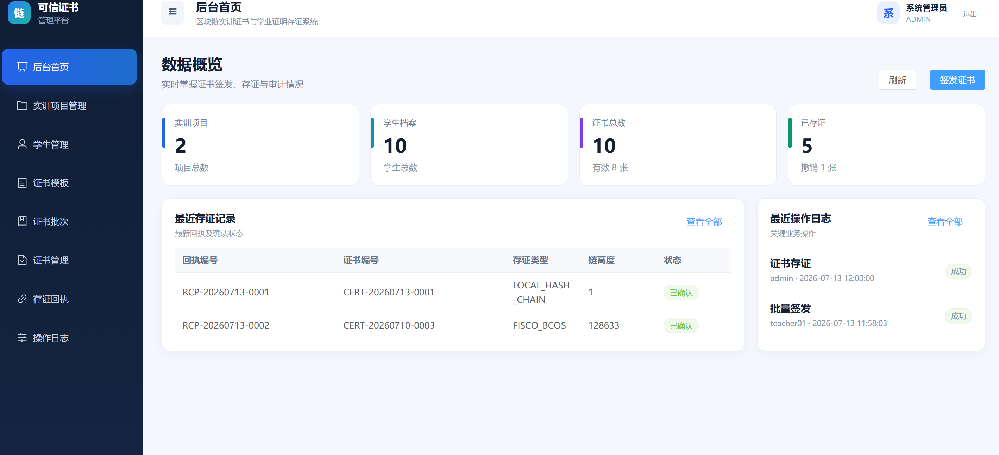
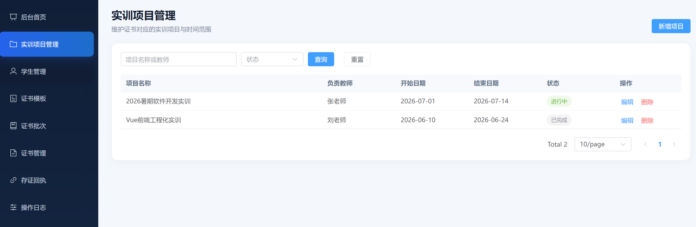
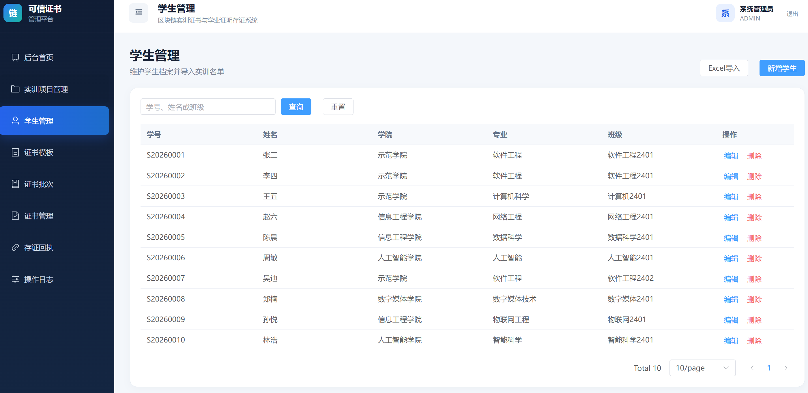
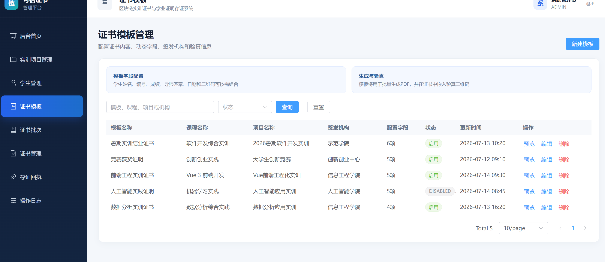
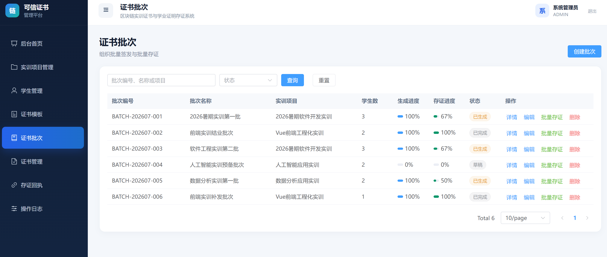
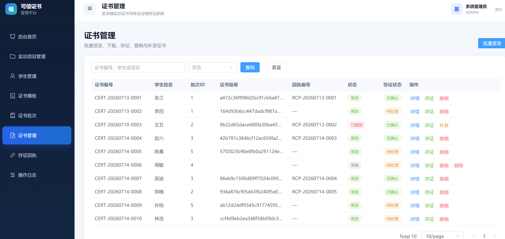
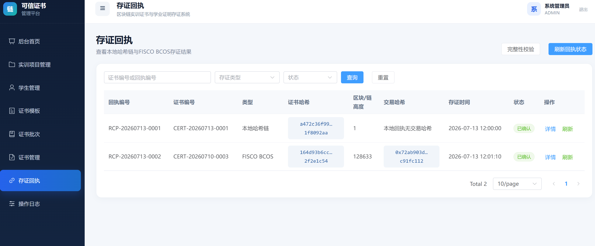
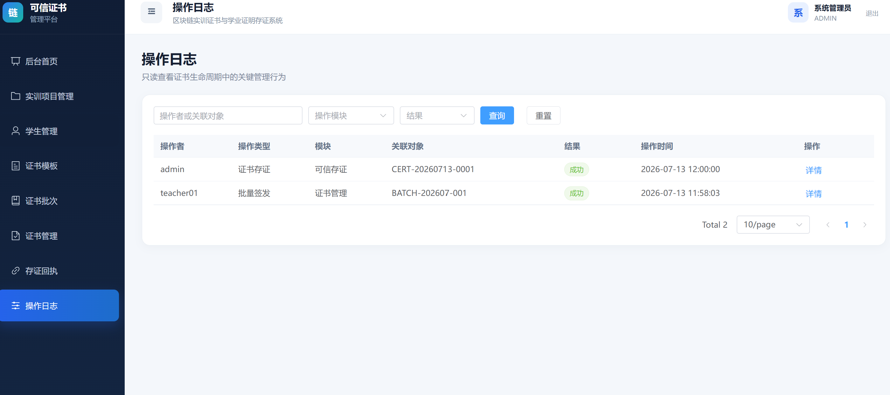

# 管理员前端 7-14 交付

本文件汇总管理员前端截至 2026 年 7 月 14 日完成并提交的页面截图、路由清单、Mock 数据说明、后端接口清单以及风险与阻塞。

### 1. 管理端页面截图

#### 登录页

#### 后台首页

#### 实训项目管理

#### 学生管理

#### 证书模板

#### 证书批次

#### 证书管理

#### 存证回执

#### 操作日志

共 9 张管理端页面截图。
### 2. 路由清单

| 页面 | 路径 | Vue 文件 |
| --- | --- | --- |
| 登录 | `/login` | `src/views/LoginView.vue` |
| 后台首页 | `/dashboard` | `src/views/DashboardView.vue` |
| 实训项目管理 | `/projects` | `src/views/ProjectsView.vue` |
| 学生管理/Excel 导入 | `/students` | `src/views/StudentsView.vue` |
| 证书模板 | `/templates` | `src/views/TemplatesView.vue` |
| 证书批次 | `/batches` | `src/views/BatchesView.vue` |
| 证书管理 | `/certificates` | `src/views/CertificatesView.vue` |
| 存证回执 | `/chain` | `src/views/ChainView.vue` |
| 操作日志 | `/audit` | `src/views/AuditView.vue` |
### 3. Mock 数据位置与冻结字段

Mock 数据位于 `src/api/mock.ts`，类型位于 `src/types/index.ts`。证书对象固定使用：

`certificate_id`、`certificate_no`、`student_id`、`student_no`、`student_name`、`batch_id`、`template_id`、`pdf_path`、`certificate_hash`、`qr_code_path`、`verify_url`、`receipt_id`、`status`、`credential_type`、`root_id`。

证书列表至少展示：`certificate_no`、`student_name`、`batch_id`、`certificate_hash`、`receipt_id`、`status`。

### 4. 需要 FastAPI 后端支持的接口与字段

所有接口返回统一外层：`code`、`message`、`data`。分页接口的 `data` 使用 `records`、`total`、`current`、`size`。

| 方法与路径 | 请求字段 | `data` 返回字段 |
| --- | --- | --- |
| `POST /api/auth/login` | `username`、`password` | `token`、`user.id`、`user.username`、`user.display_name`、`user.role` |
| `GET /api/admin/dashboard/statistics` | 无 | `project_count`、`student_count`、`certificate_count`、`evidenced_count`、`valid_count`、`revoked_count` |
| `GET /api/admin/students` | `current`、`size`、`keyword` | 分页；记录含 `student_id`、`student_no`、`student_name`、`college`、`major`、`class_name` |
| `POST /api/admin/students` | `student_no`、`student_name`、`college`、`major`、`class_name` | 新增后的学生对象 |
| `PUT /api/admin/students/{student_id}` | 可编辑学生字段 | 更新后的学生对象 |
| `DELETE /api/admin/students/{student_id}` | 路径参数 `student_id` | 可为空 |
| `POST /api/admin/students/import` | `multipart/form-data`：`file`、`batch_name`、`template_id` | `success_count`、`failed_count`、`failures[].row`、`failures[].reason` |
| `GET /api/admin/templates` | `current`、`size`、`keyword`、`status` | 分页；记录含 `template_id`、`name`、`issuer`、`course_name`、`project_name`、`certificate_title`、`content`、`issue_year`、`fields`、`enabled`、`updated_at` |
| `POST /api/admin/templates` | 模板字段，不含 `template_id` | 新增后的模板对象 |
| `PUT /api/admin/templates/{template_id}` | 可编辑模板字段 | 更新后的模板对象 |
| `DELETE /api/admin/templates/{template_id}` | 路径参数 `template_id` | 可为空 |
| `GET /api/admin/batches` | `current`、`size`、`keyword`、`status` | 分页；记录含 `batch_id`、`batch_no`、`batch_name`、`project_name`、`template_id`、`student_count`、`generated`、`evidenced`、`status` |
| `POST /api/admin/batches` | `batch_name`、`project_name`、`template_id`、`status` | 新增后的批次对象 |
| `PUT /api/admin/batches/{batch_id}` | 可编辑批次字段 | 更新后的批次对象 |
| `DELETE /api/admin/batches/{batch_id}` | 路径参数 `batch_id` | 可为空 |
| `GET /api/admin/certificates` | `current`、`size`、`keyword`、`status` | 分页；记录必须使用全部冻结证书字段 |
| `GET /api/admin/certificates/{certificate_id}` | 路径参数 `certificate_id` | 单个证书对象，使用全部冻结字段 |

当前使用 Mock 时设置 `VITE_USE_MOCK=true`；切换 FastAPI 只需设置为 `false`，页面不需要修改。
### 5. 风险与阻塞

#### 当前风险

| 等级 | 风险 | 影响 | 建议处理 |
| --- | --- | --- | --- |
| 中 | 当前页面主要使用 Mock 数据 | 新增、编辑、存证等变更仅存在于浏览器内存，刷新页面后恢复初始状态 | 后端接口完成后切换 `VITE_USE_MOCK=false`，所有操作成功后重新请求列表 |
| 中 | Mock 登录账号和密码为 `admin / 123456` | 演示密码会出现在前端源码和构建文件中，不适合正式环境 | 正式部署前删除默认值和演示提示，管理员账号由 FastAPI 初始化 |
| 中 | Token 当前保存在 `localStorage` | 如果页面发生 XSS，Token 可能被读取 | 联调时确认 JWT 过期机制；正式环境优先考虑 `HttpOnly`、`Secure` Cookie |
| 中 | 前端角色和菜单权限可以在浏览器中被修改 | 只依赖前端权限可能造成越权调用 | FastAPI 必须对每个接口校验 JWT 和角色，前端权限仅用于页面展示 |
| 低 | 页面中的学生、编号、哈希和回执均为模拟数据 | 不能作为真实业务或验真结果使用 | 联调后以 MySQL 和证书生成/存证模块返回数据为准 |
| 低 | 当前生产包体积较大 | 首次加载速度可能受影响 | 基础版可暂不处理，后续按模块拆包 |

#### 当前阻塞

| 阻塞事项 | 影响范围 | 需要谁确认/提供 | 解除条件 |
| --- | --- | --- | --- |
| FastAPI 管理端接口尚未完成或尚未提供可访问地址 | 登录、首页统计、学生、模板、批次、证书列表无法真实联调 | 后端负责人 | 提供接口地址、端口、Swagger 文档和可用测试账号 |
| Vite 当前代理目标仍为 `http://localhost:8080` | 如果 FastAPI 使用默认 `8000` 端口，请求会代理失败 | 后端负责人和管理员前端负责人 | 确认 FastAPI 端口后修改 `vite.config.ts` 代理地址 |
| 证书 PDF、二维码和 SHA-256 尚未由证书模块返回 | 前端无法展示真实 `pdf_path`、`qr_code_path`、`certificate_hash` | 证书生成负责人 | 提供证书生成接口及冻结字段返回值 |
| 本地哈希链/区块链存证接口尚未联调 | 存证后状态不能持久化，也无法产生真实 `receipt_id`、交易哈希和区块高度 | 存证/区块链负责人 | 提供单证存证、批量存证、回执列表和完整性校验接口 |
| 接口草案与 FastAPI 最终字段尚未逐项确认 | 后端字段或分页结构变化可能导致页面无数据 | 前后端共同确认 | 确认统一响应 `{code,message,data}`、分页结构及冻结字段不变 |
| 撤销、补发和操作日志后端流程尚未提供 | 相关按钮当前只能完成 Mock 演示 | 证书后端负责人 | 提供撤销、补发、关联关系和审计日志接口 |

#### 当前不阻塞 7 月 14 日交付的事项

- PDF、二维码、SHA-256、本地哈希链和 FISCO BCOS 的真实生成不属于本次管理员前端 7 月 14 日基础页面交付。
- Mock 刷新后恢复初始状态属于当前阶段的预期行为。
- 本次截图、路由清单、冻结字段 Mock、接口草案和风险阻塞说明均已完成，可以作为 7 月 14 日交付内容提交。
