# 管理员前端 7-17 交付

## 一、管理员端最终截图包

截图目录：`docs/协作管理/2026-07-17管理员前端交付截图/`

### 1. ADMIN 系统管理员

#### 登录页

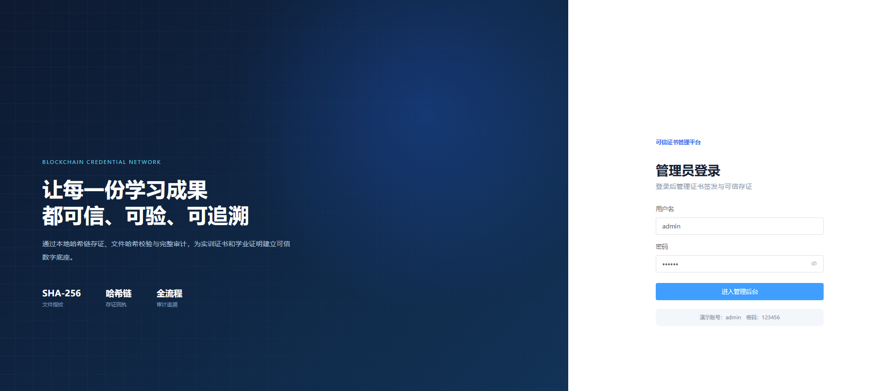

#### 后台首页

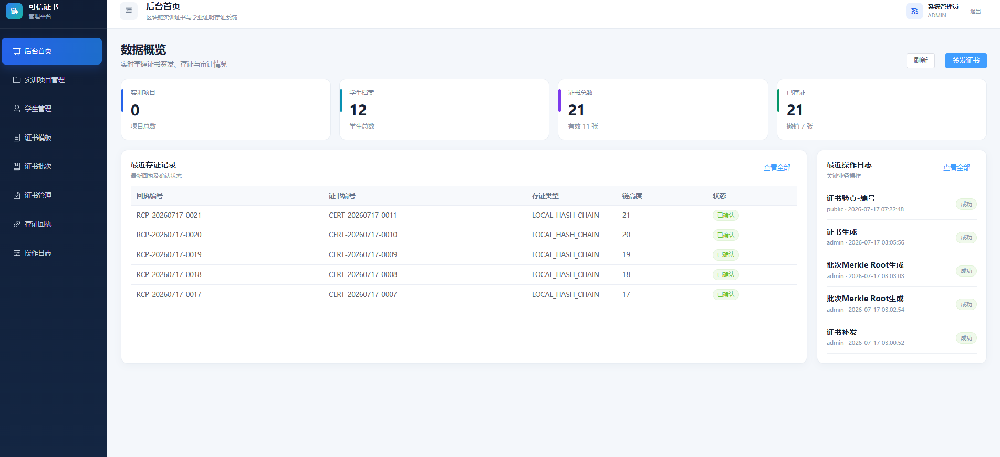

#### 实训项目管理

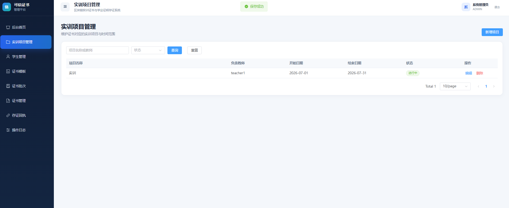

#### 学生管理

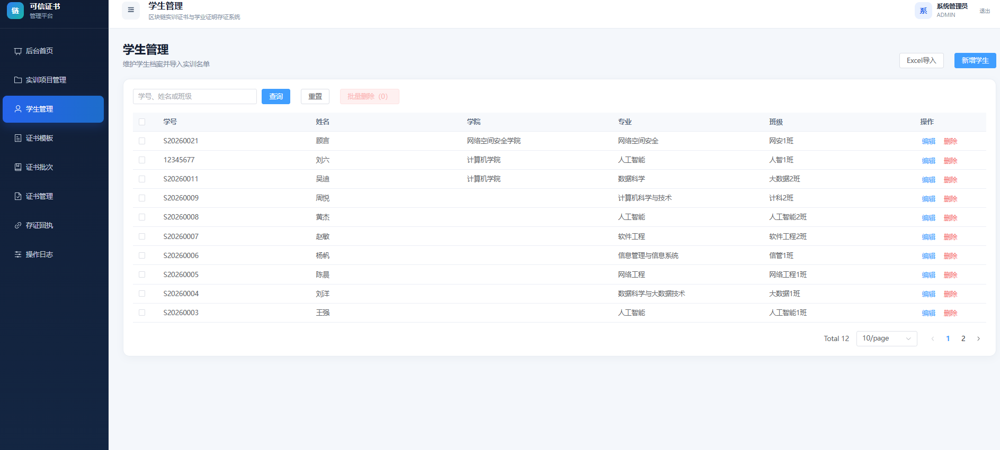

#### 证书模板

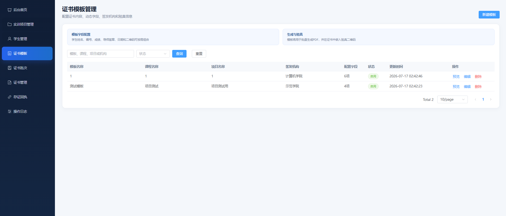

#### 证书批次

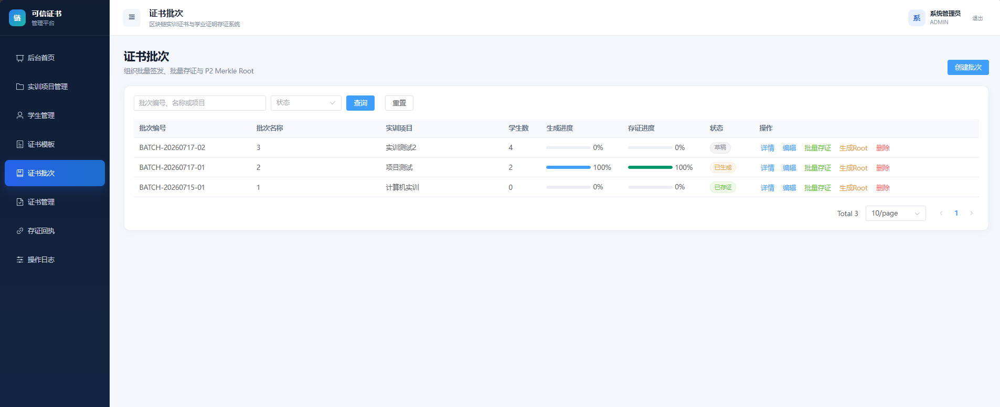

#### 证书管理

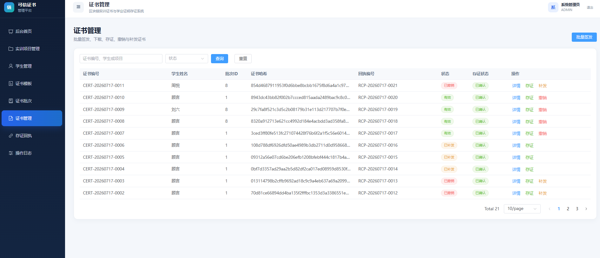

#### 存证回执

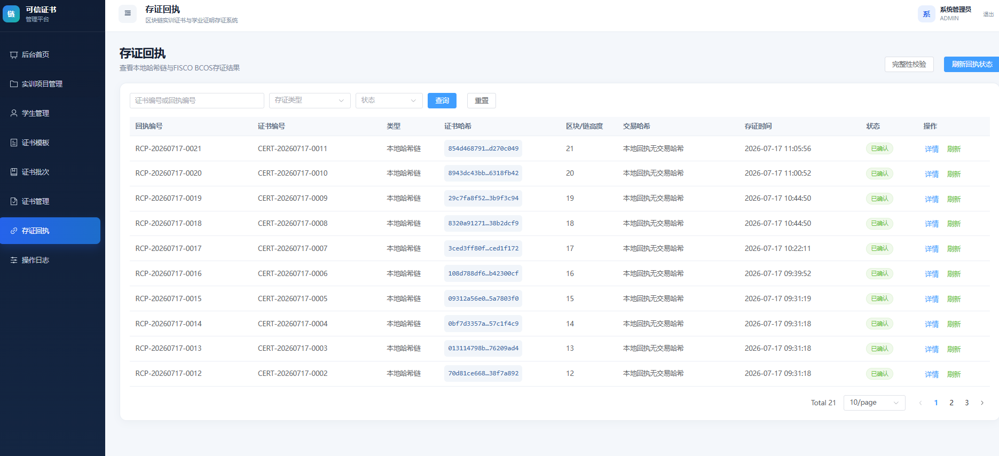

#### 操作日志

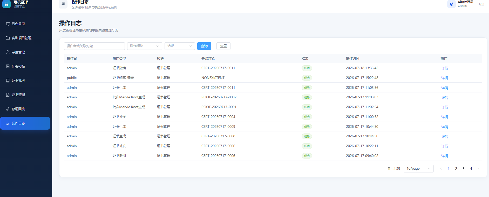

### 2. TEACHER 实训教师

#### 登录页

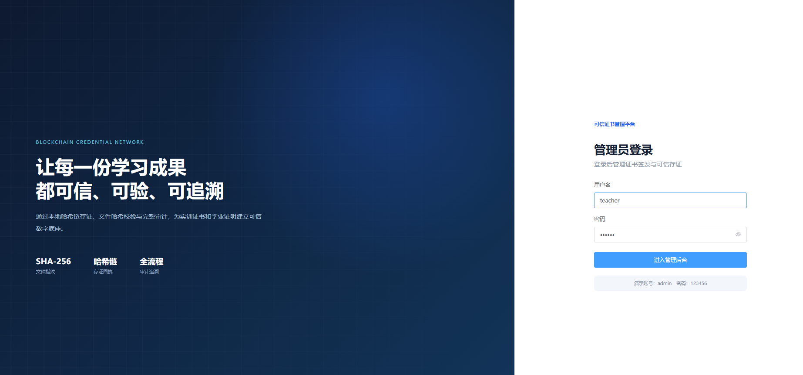

#### 实训项目管理

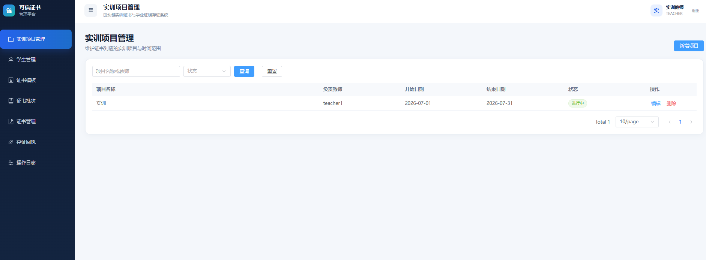

#### 学生管理

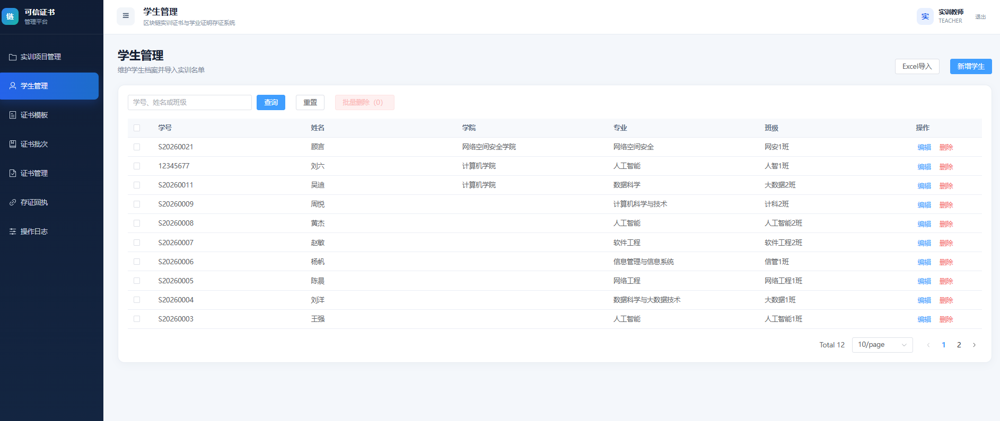

#### 证书模板

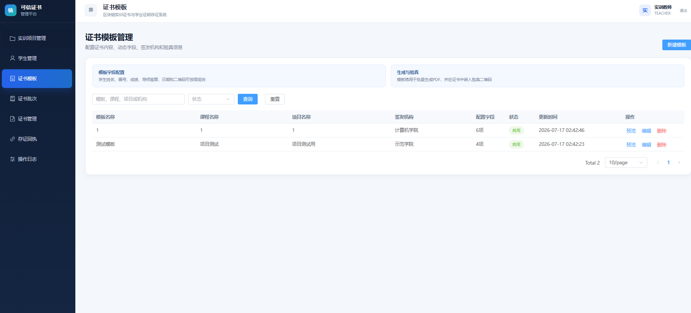

#### 证书批次

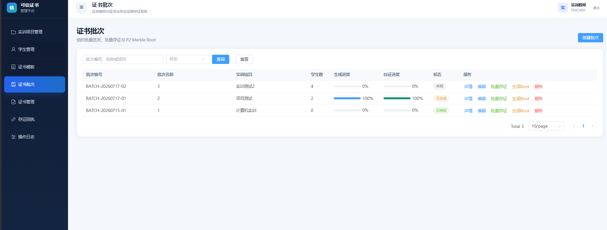

#### 证书管理

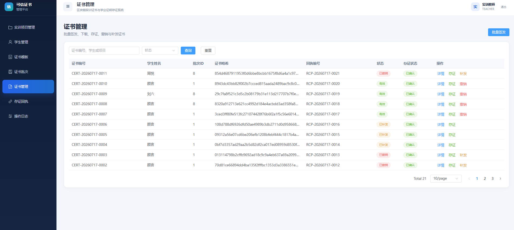

#### 存证回执

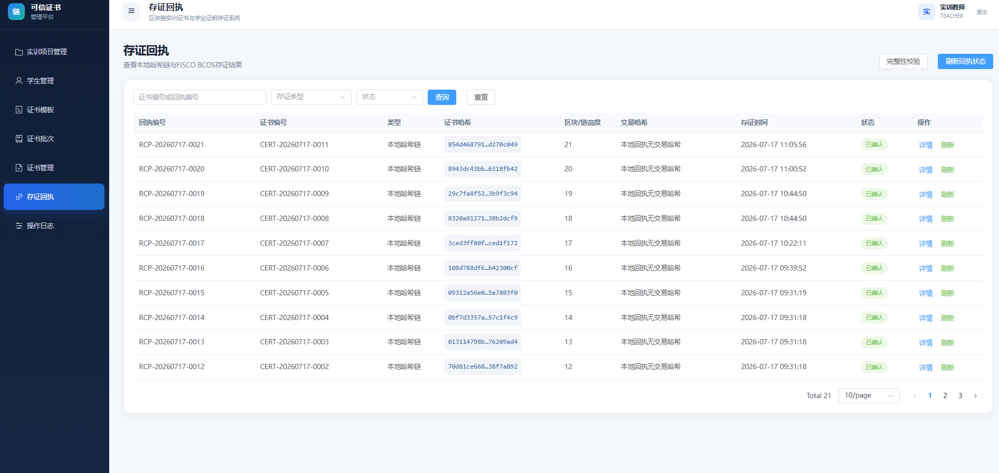

#### 操作日志

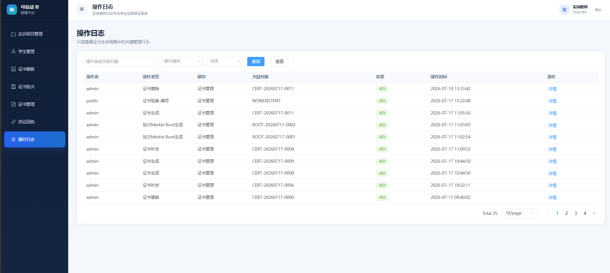

### 3. AUDITOR 审计员

#### 登录页

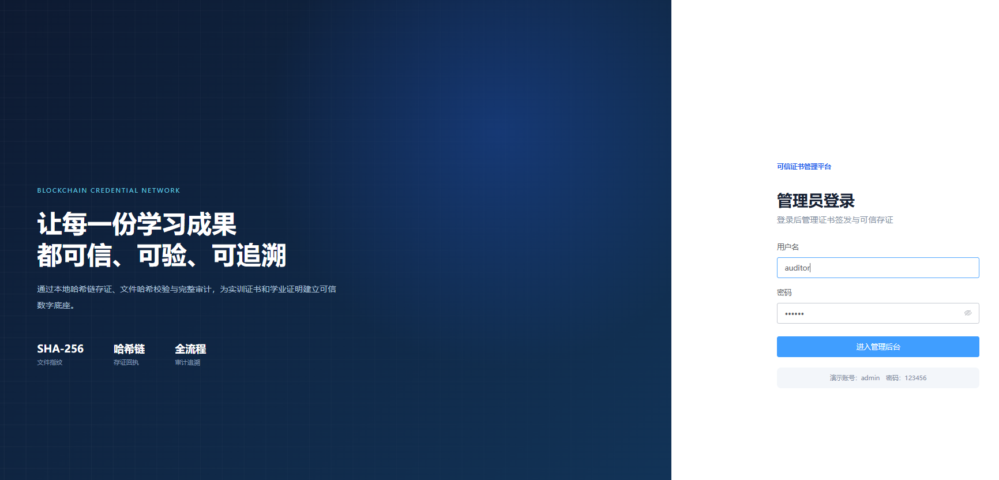

#### 存证回执（只读）

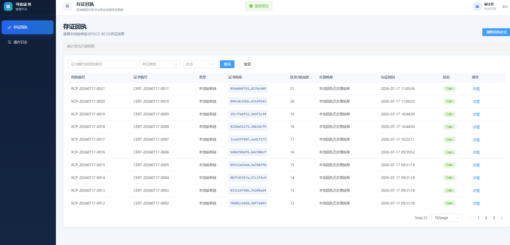

#### 操作日志（只读）

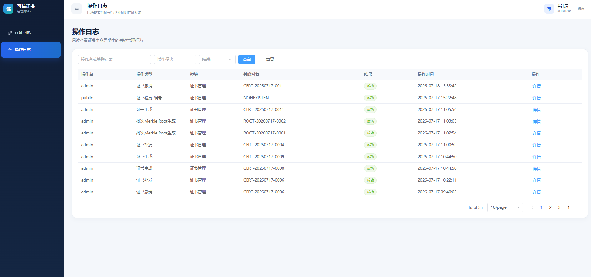

## 二、三类角色权限表

| 页面或功能 | ADMIN | TEACHER | AUDITOR |
| --- | --- | --- | --- |
| 后台首页 | 可查看统计、最近存证记录和最近操作日志 | 无权限，登录后进入实训项目管理 | 无权限，登录后进入存证回执 |
| 实训项目管理 | 查询、新增、编辑、删除 | 查询、新增、编辑、删除 | 无权限 |
| 学生管理 | 查询、新增、编辑、删除、批量删除、Excel 导入 | 查询、新增、编辑、删除、批量删除、Excel 导入 | 无权限 |
| 证书模板 | 查询、新增、编辑、删除、预览 | 查询、新增、编辑、删除、预览 | 无权限 |
| 证书批次 | 查询、创建、编辑、删除、选择学生、批量存证、生成 Merkle Root、查看存证信息 | 查询、创建、编辑、删除、选择学生、批量存证、生成 Merkle Root、查看存证信息 | 无权限 |
| 证书管理 | 查询、详情、批量签发、下载、存证、撤销、补发 | 查询、详情、批量签发、下载、存证、撤销、补发 | 无权限 |
| 存证回执 | 查询、刷新状态、查看详情、完整性校验 | 查询、刷新状态、查看详情、完整性校验 | 只读查询、刷新列表、查看详情和完整性校验 |
| 操作日志 | 只读查询和查看详情 | 只读查询和查看详情 | 只读查询和查看详情 |
| 未授权路由 | 跳转 403 | 跳转 403 | 跳转 403 |

### 角色说明

- `ADMIN`：系统管理员，拥有管理员端全部页面及业务操作权限。
- `TEACHER`：实训教师，负责项目、学生、模板、批次、证书签发及存证业务；不能进入管理员首页。
- `AUDITOR`：审计员，仅能查看存证回执和操作日志，不允许新增、编辑、删除、签发、撤销或补发。
- 登录后的默认页面：`ADMIN` 进入 `/dashboard`，`TEACHER` 进入 `/projects`，`AUDITOR` 进入 `/chain`。

## 三、前端生产构建日志

### 构建命令

```powershell
PS D:\实训\admin-web> npm run build
```

### 构建结果

```text
> certificate-admin-web@0.1.0 build
> vue-tsc -b && vite build

vite v6.4.3 building for production...
✓ 1706 modules transformed.

dist/index.html                                                         0.50 kB │ gzip:   0.36 kB
dist/assets/BatchesView-D_PoDFYd.css                                    0.39 kB │ gzip:   0.23 kB
dist/assets/PublicVerifyView-D-la8ZhY.css                               2.55 kB │ gzip:   0.79 kB
dist/assets/index-DnEMvjte.css                                        367.48 kB │ gzip:  50.44 kB
dist/assets/projects-BvEHCeoX.js                                        0.35 kB │ gzip:   0.20 kB
dist/assets/PageHeader.vue_vue_type_script_setup_true_lang-Ud0lsKkY.js  0.35 kB │ gzip:   0.26 kB
dist/assets/time-DOOl4ulQ.js                                            0.35 kB │ gzip:   0.27 kB
dist/assets/students-CvsBWDML.js                                        0.51 kB │ gzip:   0.28 kB
dist/assets/ErrorView-B2B-SZsz.js                                       0.58 kB │ gzip:   0.44 kB
dist/assets/StatusTag.vue_vue_type_script_setup_true_lang-CM8wz4_n.js   1.02 kB │ gzip:   0.63 kB
dist/assets/certificates-_nuKLH1f.js                                    1.10 kB │ gzip:   0.39 kB
dist/assets/templates-D38g6w5F.js                                       1.95 kB │ gzip:   0.85 kB
dist/assets/LoginView-BTTpURCe.js                                       2.43 kB │ gzip:   1.43 kB
dist/assets/DashboardView-BDzMEJWX.js                                   3.28 kB │ gzip:   1.58 kB
dist/assets/AuditView-Bny16sk9.js                                       3.92 kB │ gzip:   1.71 kB
dist/assets/ProjectsView-CZNvv41d.js                                    4.89 kB │ gzip:   2.01 kB
dist/assets/PublicVerifyView-B_EfNjfY.js                                5.65 kB │ gzip:   2.47 kB
dist/assets/ChainView-o30J5_YB.js                                       6.50 kB │ gzip:   2.60 kB
dist/assets/StudentsView-CIUsMNWE.js                                    6.84 kB │ gzip:   2.68 kB
dist/assets/BatchesView-Bs-MKTcF.js                                     9.35 kB │ gzip:   3.43 kB
dist/assets/TemplatesView-DopN6Ojp.js                                   9.51 kB │ gzip:   3.65 kB
dist/assets/CertificatesView-CpS9tIkc.js                                9.66 kB │ gzip:   3.30 kB
dist/assets/index-BN8l56CN.js                                       1,097.27 kB │ gzip: 364.59 kB

(!) Some chunks are larger than 500 kB after minification.
✓ built in 7.46s
```

### 构建结论

- TypeScript 类型检查通过。
- Vite 生产构建成功，共转换 `1706` 个模块。
- 生产文件已输出至 `dist/` 目录。
- 主 JavaScript chunk 压缩后超过 `500 kB`，属于已记录的非阻塞性能风险，不影响本次构建交付和页面运行。
- `@vueuse/core` 的 `PURE` 注释位置警告来自第三方依赖，Rollup 已自动移除相关注释，不影响构建结果。

## 四、前端问题清单

### 4.1 已解决问题

| 编号 | 模块/接口 | 原错误现象 | 原因 | 处理结果 |
| --- | --- | --- | --- | --- |
| FE-01 | 全部 `/api/**` 请求 | 页面频繁显示 500，Vite 终端出现 `ECONNREFUSED` | 项目残留的 `vite.config.js` 优先于 `vite.config.ts` 生效，并把代理错误指向 `http://localhost:8080` | 已删除旧的 `vite.config.js`、`vite.config.d.ts`，并加入 `.gitignore`；Vite 现读取最新 TypeScript 配置 |
| FE-02 | Vite 跨电脑代理 | 修改后端 IP 后代理仍未按预期生效 | 真实局域网 IP 与可提交配置混用，且修改环境文件后未重启进程 | 已使用 `.env.development.local` 保存 `VITE_PROXY_TARGET`，通过 `.env.*.local` 规则禁止提交；修改后重启 `npm run dev` 生效 |
| FE-03 | Axios 统一响应 | 真实后端返回成功仍可能被前端判断为失败 | 前端曾以 `code=200` 判断业务成功，后端统一规范为 `code=0` | 响应拦截器已统一使用 `code=0`，并优先展示后端 `message/detail` |
| FE-04 | `GET/POST/PUT /api/admin/templates` | 模板预览把 Python 字典字符串整体显示为证书正文 | 旧后端将模板配置序列化为字符串，前端直接渲染 `content` | 前端已兼容结构化 `content_config` 和旧字符串配置，只渲染真实正文 |
| FE-05 | 证书模板签发机构 | 模板列表和预览固定显示“示范学院”，无法正确保存自定义机构 | 前后端缺少统一的签发机构字段 | 已对接 `institution_name`，模板新增、编辑、列表、预览和证书详情均可读取该字段 |
| FE-06 | `POST /api/admin/batches` | 创建批次只能手填项目名称，无法关联 MySQL 中的真实项目 | PR #28 新增 `project_id`，旧前端仍仅提交 `project_name` | 已改为真实项目和真实模板下拉选择，并提交 `project_id`、`project_name`、`template_id`、`student_ids` |
| FE-07 | `POST /api/admin/batches/{batch_id}/generate` | 批量签发曾出现 `template_id=1 not found` 或“请完整选择签发信息” | 使用固定模板 ID或下拉项内部 ID 未正确取得 | 已改为从真实项目、模板、批次和学生接口加载选项，并提交冻结字段要求的 ID |
| FE-08 | 学生学院字段 | Excel 导入或编辑后学院仍显示默认值 | 前后端 `college` 字段曾未完整保存和回传 | 后端字段升级后前端已沿用 `college`，导入和编辑页面能够显示真实学院 |
| FE-09 | 批次进度展示 | 生成进度、存证进度显示 `150%` | 接口返回的完成数大于 `student_count`，前端未限制百分比范围 | 前端已将百分比限制为 `0–100%`，避免异常布局；后端数据一致性问题单独保留 |
| FE-10 | 时间显示 | 操作时间、存证时间与本地真实时间存在时区偏差 | 后端返回 UTC，页面未统一转换 | 操作日志和存证回执已统一转换为本地时间展示 |

### 4.2 待联调确认或后端协作问题

| 编号 | 模块/接口 | 当前情况 | 后续验证要求 |
| --- | --- | --- | --- |
| LINK-01 | 批次统计 | 曾出现 `student_count=2`，但 `generated/evidenced=3` | 后端检查重复签发、证书批次关联和统计是否去重；前端限制100%不能替代数据修复 |
| LINK-02 | `DELETE /api/admin/students/{student_id}` | 早期测试出现 `Network Error`；有关联证书时后端应拒绝删除 | 在稳定连接下分别验证可删除学生、有关联证书返回409、数据库记录和审计日志一致 |
| LINK-03 | `POST /api/admin/certificates/{id}/revoke` | 前端已提供原因填写、二次确认和成功后刷新 | 验证状态变为 `REVOKED`、撤销记录与审计日志落库、公共验真同步变化；重复撤销应返回409 |
| LINK-04 | `POST /api/admin/certificates/{id}/reissue` | 前端补发表单和新旧证书关联展示已实现 | 验证仅 `REVOKED` 证书可补发、新证书不覆盖旧证书、重复补发返回409 |
| LINK-05 | `POST /api/admin/batches/{batch_id}/merkle-root` | 前端可展示 Merkle Root、Root 链哈希、叶子数和交易哈希 | 使用真实批次验证 Root；未配置测试链时无 `tx_hash` 属正常降级，配置链后需核对真实交易哈希 |
| LINK-06 | `GET /api/verification/{certificate_no}/merkle-proof` | 公共验真页已实现可选“批次级存证”区块 | 验证 `merkle_root`、`current_root_hash`、`tx_hash`、Proof 路径和 `proof_valid` 的真实返回 |
| LINK-07 | 模板与证书签发机构 | 前端已对接 `institution_name` | 验证模板保存值、证书快照、PDF正文和公共验真结果使用同一签发机构 |
| LINK-08 | ADMIN/TEACHER/AUDITOR 权限 | 菜单、默认首页和403路由已经实现 | 最终回归三类账号；确认 AUDITOR 写操作返回403，ADMIN/TEACHER 写操作有明确反馈 |

### 4.3 非阻塞风险与说明

- 生产构建成功，但主 JavaScript chunk 超过 `500 kB`。该问题属于后续性能优化，不阻塞本次验收。
- `@vueuse/core` 的 `PURE` 注释警告来自第三方依赖，Rollup 已自动处理，不影响构建结果。
- `LOCAL_HASH_CHAIN` 或本地 Merkle Root 没有真实 `tx_hash`、区块高度和合约地址时，页面显示“本地 Root 暂无链上交易哈希”属于正常降级，不应伪造链上字段。
- PowerShell 中中文 `display_name` 偶尔显示乱码属于终端响应编码问题，不影响浏览器中的 UTF-8 页面展示和角色判断。
- 手机扫码和固定二维码地址依赖现场局域网及后端 `PUBLIC_VERIFY_BASE_URL`，需在最终演示环境中统一彩排。

## 五、交付状态

- 管理员端最终截图包：已整理，共20张。
- 三类角色权限表：已完成。
- 前端生产构建日志：已完成，构建成功。
- 前端问题清单：已完成。
